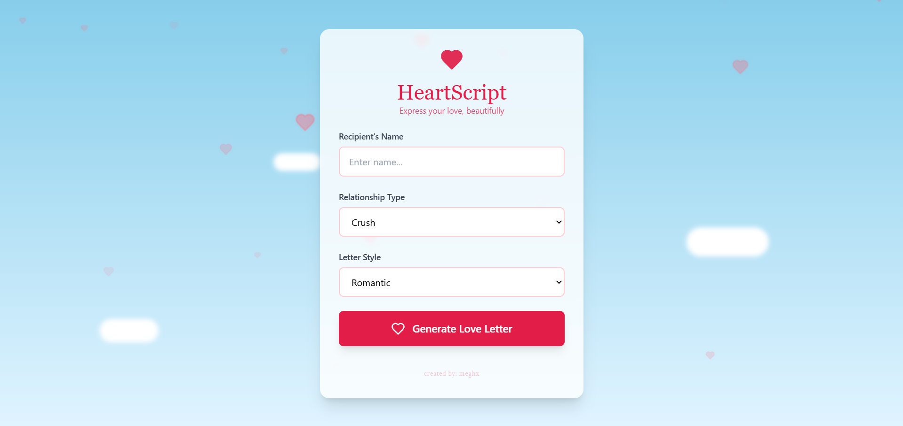
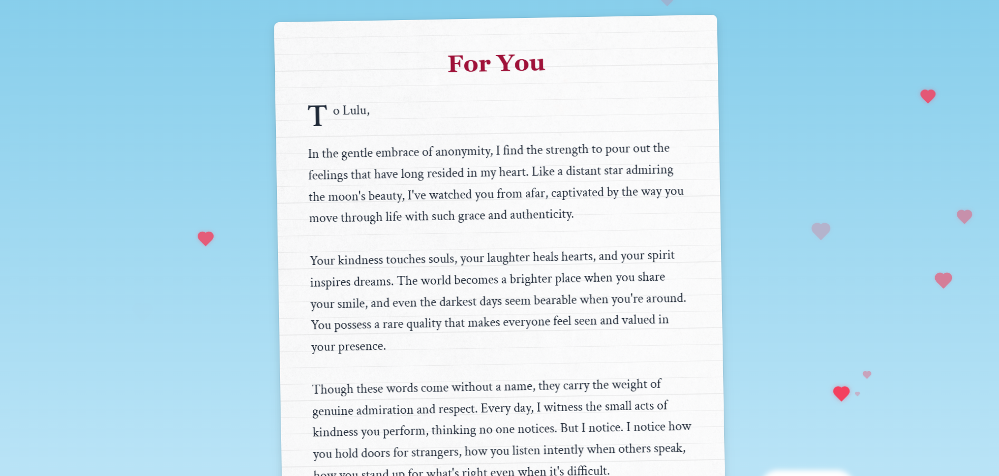

# ❤️ Heart Script – Personalized Love Letter Generator  

Heart Script is a web application that generates personalized love letters based on user inputs. Whether for a **crush, partner, or best friend**, this app creates heartfelt messages in various tones – **romantic, funny, or poetic**.  

---

## ✨ Features  

- **Personalized Love Letters** – Generate unique messages based on recipient name, relationship type, and letter style.  
- **Multiple Relationship Types** – Select from Crush, Partner, or Best Friend.  
- **Various Letter Styles** – Choose between Romantic, Funny, or Poetic.  
- **Instant Generation** – Click a button to create a heartfelt message instantly.  
- **Social Sharing** – Share directly via **Instagram, Twitter, Telegram, and WhatsApp**.  
- **Download Option** – Save the letter as a file for later.  

---

## 📸 Screenshots  

### Landing Page
Get started with Heart Script! Enter recipient details on our intuitive landing interface.


### Letter Generation Interface
Select relationship type and letter style, then generate your personalized love letter.



### Generated Letter
Beautiful, personalized love letter ready to share or download!



---

## 🛠 Tech Stack  

- **TypeScript** – Scalable and maintainable development.  
- **CSS** – Ensures a visually appealing UI.  
- **JavaScript** – Adds interactive functionality.  
- **HTML** – Structures the content.  

---

## 🎯 How It Works  

1️⃣ **Enter the recipient’s name.**  
2️⃣ **Select the type of relationship (Crush, Partner, Best Friend).**  
3️⃣ **Choose a letter style (Romantic, Funny, Poetic).**  
4️⃣ **Click "Generate Love Letter".**  
5️⃣ **Download or share the letter via social media.**  

---

## 📸 Screenshots  

🚀 _Coming soon!_  

---

## 🔗 Live Demo  

🔴 **[Try Heart Script Here](https://code-and-confess-527po0d65-megha-ranjiths-projects.vercel.app/)**

---

## 📌 Installation  

```sh
git clone https://github.com/your-username/heart-script.git
cd heart-script
npm install
npm run dev
```
---

## 🤝 Contributing
Contributions are welcome! Feel free to fork this repository and submit a pull request.

---

## 📜 License
This project is licensed under the MIT License.
